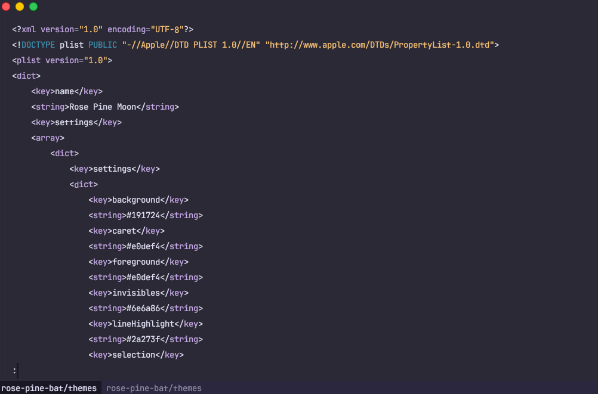

<p align="center">
    
    <h2 align="center">Rosé Pine for bat</h2>
</p>

<p align="center">All natural pine, faux fur and a bit of soho vibes for the classy minimalist</p>

<p align="center">
    <a href="https://github.com/rose-pine/rose-pine-theme">
        
    </a>
</p>

Syntax highlighting theme for [**bat**](https://github.com/sharkdp/bat) (a `cat` clone with wings). Colors follow **Rosé Pine Moon**, with a base background of `#191724` so it pairs nicely with the main Rosé Pine palette and dark terminals.

## Usage

1. Install [bat](https://github.com/sharkdp/bat) (for example: `brew install bat` on macOS).

2. Clone this repository (or download [`themes/Rose-Pine-Moon.tmTheme`](themes/Rose-Pine-Moon.tmTheme)).

3. Copy the theme into bat’s themes directory (see [Adding new themes](https://github.com/sharkdp/bat#adding-new-themes) in the bat README):

   ```bash
   mkdir -p "$(bat --config-dir)/themes"
   cp themes/Rose-Pine-Moon.tmTheme "$(bat --config-dir)/themes/"
   ```

   If you cloned the repo elsewhere, adjust the `cp` source path.

4. Refresh bat’s cached themes:

   ```bash
   bat cache --build
   ```

5. Confirm the theme is registered. **bat uses the `.tmTheme` file name (without extension) as the theme id:**

   ```bash
   bat --list-themes | grep -i rose
   ```

   You should see **`Rose-Pine-Moon`**.

6. Use it by default (pick one):
   - **Config file** — path from `bat --config-file`, often `~/.config/bat/config`:

     ```bash
     echo '--theme="Rose-Pine-Moon"' >> "$(bat --config-dir)/config"
     ```

   - **Environment variable:**

     ```bash
     export BAT_THEME="Rose-Pine-Moon"
     ```

   - **One-off:**

     ```bash
     bat --theme="Rose-Pine-Moon" README.md
     ```

> [!NOTE]
> After any change to the file under `themes/`, run `bat cache --build` again.

## Variants

| File                     | Description                        |
| ------------------------ | ---------------------------------- |
| `Rose-Pine-Moon.tmTheme` | Rosé Pine Moon–style syntax colors |

## Gallery



## Thanks to

- [sharkdp/bat](https://github.com/sharkdp/bat) for bat
- [Rosé Pine](https://github.com/rose-pine) for the palette

## Contributing

Issues and pull requests are welcome. For palette tweaks, prefer staying aligned with [Rosé Pine Moon](https://rosepinetheme.com/) unless you are intentionally documenting a fork variant.
