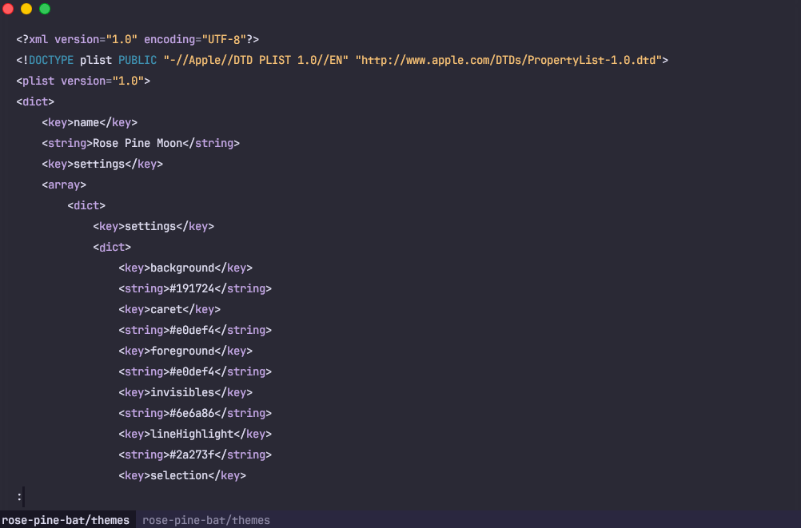
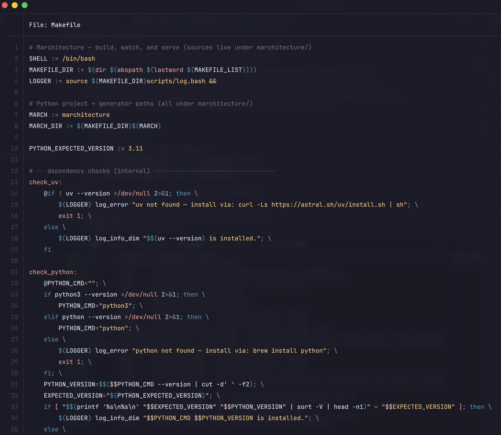

<p align="center">
    
    <h2 align="center">Rosé Pine for bat</h2>
</p>

<p align="center">All natural pine, faux fur and a bit of soho vibes for the classy minimalist</p>

<p align="center">
    <a href="https://github.com/rose-pine/rose-pine-theme">
        
    </a>
</p>

Syntax highlighting themes for [**bat**](https://github.com/sharkdp/bat) (a `cat` clone with wings), following the [Rosé Pine](https://rosepinetheme.com/) palette. The dark variants (`Rose-Pine` and `Rose-Pine-Moon`) use a base background of `#191724`; the light `Rose-Pine-Dawn` variant uses `#faf4ed`.

## Variants

| Theme            | File                            | Description                                                                  |
| ---------------- | ------------------------------- | ---------------------------------------------------------------------------- |
| `Rose-Pine-Moon` | `themes/Rose-Pine-Moon.tmTheme` | Rosé Pine **Moon** — brighter blue keywords, warm peach functions            |
| `Rose-Pine`      | `themes/Rose-Pine.tmTheme`      | Rosé Pine **Main** — muted teal keywords, softer pink functions              |
| `Rose-Pine-Dawn` | `themes/Rose-Pine-Dawn.tmTheme` | Rosé Pine **Dawn** — light variant, deep pine keywords, dusty rose functions |

bat uses the `.tmTheme` file name (without extension) as the theme id, so these install as `Rose-Pine-Moon`, `Rose-Pine`, and `Rose-Pine-Dawn`.

<table>
  <tr>
    <td width="50%"></td>
    <td width="50%"></td>
  </tr>
</table>

## Installation

Clone the repository and run the installer. It checks for bat, lets you pick which theme(s) to install, rebuilds bat's theme cache, and sets your chosen default.

```bash
git clone https://github.com/drluckyspin/rose-pine-bat.git
cd rose-pine-bat
./install.bash
```

Run interactively, you get a checkbox menu to choose theme(s) — `↑/↓` move, `space` toggle, `a` all, `n` none, `enter` confirm — followed by a prompt to pick the default theme. Then try it:

```bash
bat README.md
```

### Options

| Flag             | Description                                                     |
| ---------------- | --------------------------------------------------------------- |
| `--all`          | Install every theme (non-interactive)                           |
| `--theme NAME`   | Install a specific theme; repeatable (e.g. `--theme Rose-Pine`) |
| `--default NAME` | Set `NAME` as bat's default theme                               |
| `--install-bat`  | Install bat via Homebrew if it is missing (non-interactive)     |
| `-h`, `--help`   | Show help                                                       |

```bash
./install.bash --all                                 # install everything, default Rose-Pine-Moon
./install.bash --theme Rose-Pine --default Rose-Pine # one theme, set as default
./install.bash --install-bat                         # also install bat via Homebrew
```

In non-interactive use (piped input or CI) the installer installs all themes and sets `Rose-Pine-Moon` as the default.

## Preview the themes

To see how the variants differ — color swatches plus a live bat render of a sample snippet — run:

```bash
./scripts/compare-themes.bash
```

It uses a throwaway bat config, so it works even before you install anything and never touches your setup.

## Manual installation

If you'd rather not use the installer (see [Adding new themes](https://github.com/sharkdp/bat#adding-new-themes) in the bat README):

1. Install [bat](https://github.com/sharkdp/bat) (for example: `brew install bat` on macOS).

2. Copy the theme(s) you want into bat's themes directory:

   ```bash
   mkdir -p "$(bat --config-dir)/themes"
   cp themes/*.tmTheme "$(bat --config-dir)/themes/"
   ```

3. Rebuild bat's cached themes:

   ```bash
   bat cache --build
   ```

4. Confirm the theme is registered:

   ```bash
   bat --list-themes | grep -i rose
   ```

5. Use it by default (pick one):
   - **Config file** — path from `bat --config-file`, often `~/.config/bat/config`:

     ```bash
     echo '--theme="Rose-Pine-Moon"' >> "$(bat --config-dir)/config"
     ```

   - **Environment variable:**

     ```bash
     export BAT_THEME="Rose-Pine-Moon"
     ```

   - **One-off:**

     ```bash
     bat --theme="Rose-Pine-Moon" README.md
     ```

> [!NOTE]
> After any change to a file under `themes/`, run `bat cache --build` again.

## Gallery





## Thanks to

- [sharkdp/bat](https://github.com/sharkdp/bat) for bat
- [Rosé Pine](https://github.com/rose-pine) for the palette
- [Szizoid](https://github.com/Szizoid) for the main theme

## Contributing

Issues and pull requests are welcome. For palette tweaks, prefer staying aligned with [Rosé Pine](https://rosepinetheme.com/) unless you are intentionally documenting a fork variant.
